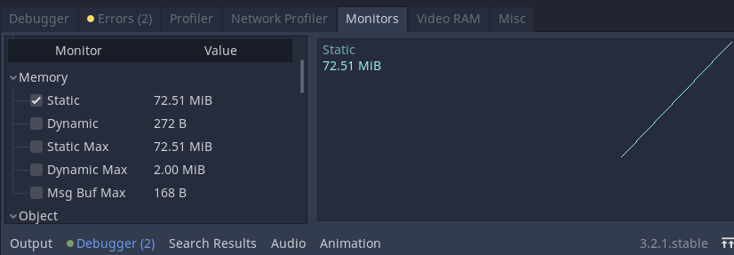

# godot-memoryleak-TextEdit
Memory leak in godot TextEdit v3.2.1

example project to reproduce the bug.

https://github.com/godotengine/godot/issues/37838




## reproduce the memory leak

When you update `TextEdit.text` the static memory increases.
The size of the data is constant.

```gdscript
# Called every frame. 'delta' is the elapsed time since the previous frame.
func _process(delta):
  text = big
```

Which can be fixed by clearing the undo history : `clear_undo_history()`
